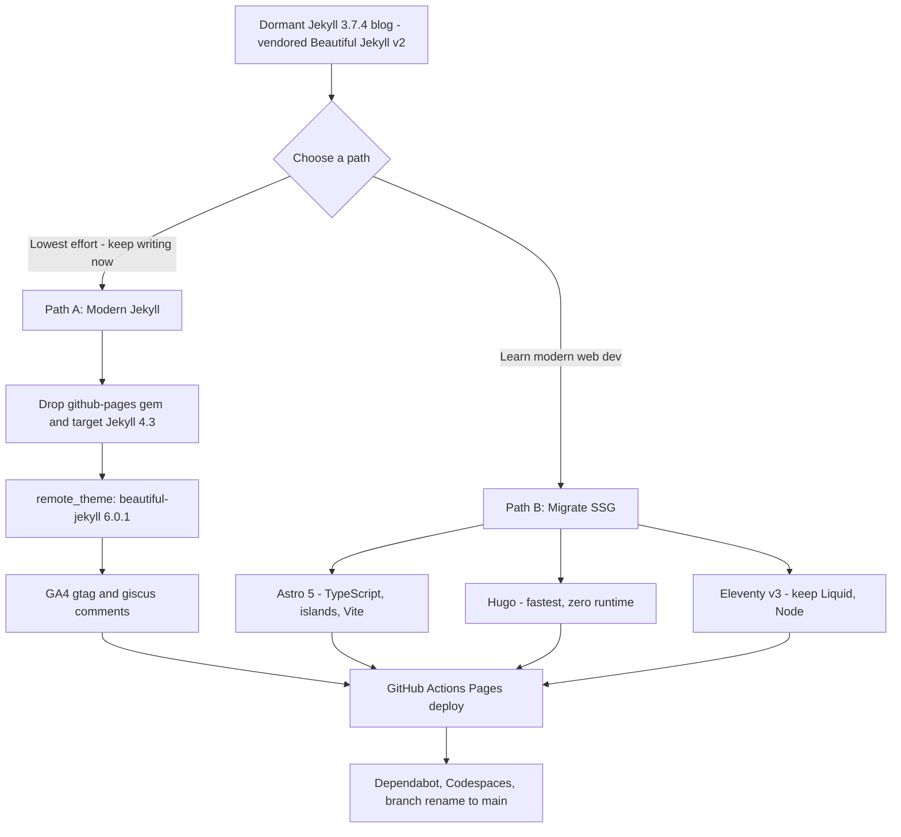

# Modernizing "Praveer's Musings" — Assessment & Roadmap

**Repo:** [praveer09/praveer09.github.io](https://github.com/praveer09/praveer09.github.io) · Live: https://praveer09.github.io
**Last commit:** `7e1b03dc` on 2018-11-25 (dormant ~6.5 years) · **Branch:** `master` (only branch)
**Stack today:** Jekyll 3.7.4 via `github-pages` gem v193, a checked-in (vendored) copy of Beautiful Jekyll v2 (Bootstrap 3, jQuery 1.11.2, Font Awesome 4.6)

---

## Executive Summary

This is your personal blog "Praveer's Musings" — 20 technical posts (2014–2018, mostly Java/Kotlin) on an old Jekyll setup that has been untouched since November 2018.[^1] The good news: the site is **still live and serving**, your content is clean Markdown that ports forward with zero loss, and Jekyll is a perfectly respectable choice in 2025.[^2] The bad news: the toolchain is badly aged — pinned to the `github-pages` gem v193 (Jekyll 3.7.4), with **9+ dependencies carrying known CVEs**, a dead Google+ link, a dead Universal Analytics tag, and a Disqus comment system worth replacing.[^3][^4] The upgrade to Jekyll 4 has a handful of fixable blockers (chiefly dropping the `github-pages` gem and moving to an Actions-based build).[^5] Because you also want to "keep current with GitHub and new ways of building apps," the highest-value modernization isn't just bumping versions — it's adopting the modern GitHub workflow (Actions-based Pages deploy, Dependabot, Codespaces, giscus comments) so the repo itself becomes your learning playground.[^6][^7] This report gives you a concrete, phased roadmap plus an honest comparison of staying on Jekyll vs. moving to Astro/Hugo/Eleventy.

---

## 1. What You Have Today (Assessment)

### The repo at a glance
| Aspect | Current state |
|---|---|
| Generator | Jekyll **3.7.4**, locked by `github-pages` gem **193** (≈2018)[^3] |
| Theme | Beautiful Jekyll **v2** — *vendored* (full copy checked into `_layouts/`, `_includes/`, `css/`, `js/`), not a gem/remote theme[^1] |
| UI libs | Bootstrap **3**, jQuery **1.11.2**, Font Awesome **4.6** — all checked in[^5] |
| Posts | 20 Markdown files in `_posts/`, June 2014 → Nov 2018[^1] |
| Comments | Disqus (`disqus: praveer09`)[^4] |
| Analytics | Universal Analytics `UA-52054839-1` — **dead since July 2023**[^4] |
| Pagination | `jekyll-paginate` v1 + hand-written `index.html` loop[^5] |
| RSS | Hand-rolled `feed.xml` Liquid template (not `jekyll-feed`)[^8] |
| CI/CD | None — legacy "deploy from branch" auto-build[^6] |
| Default branch | `master`[^1] |

### Your blog posts (all carry forward unchanged)
20 posts spanning Functional Programming, Java 8 (Optional, Streams, Comparators, Date-Time), RxJava (3-part series), Dagger 2, Spring Boot, REST testing, Kotlin, and a book review.[^1] They use clean fenced Markdown code blocks (` ```java `) rendered by kramdown + rouge — no proprietary syntax to migrate.[^9] Several companion code repos exist (`rxjava-examples` has 29★/18 forks).[^1]

### Content health notes
- **Front-matter drift:** older posts use `date: 2014-06-13 21:00:00`, newer ones `date: '2018-11-24'`; quoting of `title` is inconsistent; one post has no tags.[^9] Worth normalizing but not blocking.
- **Redundant front-matter:** `layout: post`, `comments: true`, `published: true` are already defaults in `_config.yml` — safe to strip.[^9]
- **`about-me.md` is two sentences** with a pre-2015 LinkedIn URL (`in.linkedin.com/pub/...`) — the clearest "restart writing" quick win.[^9]
- **Unused theme features:** `subtitle:` and `thumbnail-img:` are supported by the template but never used — opportunities to make post cards look modern.[^9]

---

## 2. The Aging Problem (Security & Compatibility)

### Dependencies with known CVEs (from `Gemfile.lock`)[^3]
| Gem | Locked | Status | Notable CVEs |
|---|---|---|---|
| **kramdown** | 1.17.0 | 🔴 Critical | CVE-2020-14001 (RCE, 9.8); CVE-2021-28834 (ReDoS) |
| **nokogiri** | 1.8.5 | 🔴 Multiple | 8+ CVEs via bundled libxml2/libxslt |
| **activesupport** | 4.2.10 | 🔴 EOL+CVE | CVE-2020-8165 (deserialization RCE, 9.8) |
| **rubyzip** | 1.2.2 | 🔴 Critical | CVE-2018-1000544 (arbitrary file write, 9.8) |
| **addressable** | 2.5.2 | 🟠 | CVE-2021-32740 (ReDoS) |
| **liquid** | 4.0.0 | 🟠 | CVE-2022-26471 |
| **jQuery (vendored)** | 1.11.2 | 🔴 Multiple | XSS + prototype-pollution (CVE-2019-11358, CVE-2020-11022/11023) |
| **github-pages** | 193 | 🔴 EOL | Pins everything above; current is 228+ |

> The vendored **jQuery 1.11.2** in `/js/` is *not* a gem — `bundle update` won't fix it. It must be replaced manually (or removed when moving to Bootstrap 5, which drops jQuery).[^3] **Scope note:** most of the *gem* CVEs above are build-time/supply-chain risks — your published site is static HTML/CSS/JS, so they don't expose a server-side runtime. They're still worth fixing, but the **vendored jQuery** issue is the one that runs in your readers' browsers and matters most directly.[^3]

### The hard blockers to a Jekyll 4 upgrade[^5]
1. **`github-pages` gem itself** — it hard-pins Jekyll 3.7.4 and cannot coexist with Jekyll 4. You must drop it and declare `gem "jekyll", "~> 4.3"` + plugins explicitly. GitHub Pages can *host* the static `_site` output of a Jekyll 4 build, but the legacy managed Pages build still runs Jekyll 3.x — so to use Jekyll 4 you build it yourself in **GitHub Actions** and deploy the artifact (see §4a).[^6]
2. **kramdown 1.x → 2.x** — Jekyll 4 requires kramdown ≥ 2.0 and the `kramdown-parser-gfm` gem (your `input: GFM` setting survives).[^5]
3. **`jekyll-sass-converter` 1.x → 2.x** — the Ruby `sass` 3.x gem is EOL and can't install under Jekyll 4 (moves to `sassc`/Dart Sass).[^5]
4. **Custom `index.html` pagination** — your hand-written `index.html` paginator loop and Bootstrap-3 pager are v2-era. `jekyll-paginate` v1 itself **still works** with Jekyll 4 (Beautiful Jekyll v6 depends on it), so you do **not** need `jekyll-paginate-v2`. The fix is to replace the old `index.html` with the v6 theme's `layout: home` rather than swapping the pagination plugin.[^5]

Plus soft issues: the `| prepend: site.baseurl | replace: '//','/'` workaround scattered through templates should become `| relative_url`; `layout: null` in `feed.xml` should be `layout: none`; the dead `google-plus` social entry should go.[^5][^8]

---

## 3. Two Modernization Paths for the Blog



### Path A — Modern Jekyll (recommended to *start writing fastest*)
Switch from the vendored theme to **Beautiful Jekyll v6.0.1** via `remote_theme`, so you never maintain theme internals again.[^2] Because you're dropping the `github-pages` gem, you must declare gems explicitly — including **`jekyll-remote-theme`**, which `remote_theme` needs outside the managed Pages environment:
```ruby
# Gemfile
source "https://rubygems.org"
gem "jekyll", "~> 4.3"
gem "jekyll-remote-theme"   # required for remote_theme under Actions/local
gem "jekyll-paginate"
gem "jekyll-sitemap"
gem "kramdown-parser-gfm"   # Jekyll 4 needs this for input: GFM
gem "webrick"               # required for `jekyll serve` on Ruby 3+
```
```yaml
# _config.yml
remote_theme: daattali/beautiful-jekyll@6.0.1
plugins:
  - jekyll-remote-theme
  - jekyll-paginate
  - jekyll-sitemap
gtag: "G-XXXXXXXXXX"        # GA4 — replaces dead UA tag
giscus:                      # GitHub Discussions comments
  repository: "praveer09/praveer09.github.io"
  # repository-id / category-id from giscus.app configurator
  mapping: pathname
```
**Breaking renames to apply** (v2→v6): `bigimg:` → `cover-img:`, `image:` → `thumbnail-img:`, YAML `description:` → `share-description:`, `google_analytics: UA-...` → `gtag: G-...`, remove `use-site-title:` and `link-tags:`.[^2]

**RSS:** Beautiful Jekyll v6 ships its own `feed.xml` driven by `rss-description:`. Prefer that over adding `jekyll-feed` — delete your old hand-rolled `feed.xml` and set `rss-description:` rather than running two feed mechanisms.[^2][^8]

**Be aware:** a *naive* `remote_theme` swap will look broken because v2→v6 jumps Bootstrap 3→5 and FA 4→6, and your root `index.html` still carries v2 assumptions (`use-site-title: true`, `post.image` thumbnails, Bootstrap-3 pager). The clean path: **delete** your vendored `_layouts/_includes/css/js`, **replace root `index.html`** with the v6 `layout: home`, and **remove the old `feed.xml`** — keeping only `_posts/`, custom pages, config, and images. Then let v6 supply everything else.[^5]

### Path B — Migrate to a modern generator (best for "new ways of building apps")
| Tool | Why pick it | Migration effort |
|---|---|---|
| **Astro 5** ⭐ | Teaches modern web dev: TypeScript, Vite, component "islands" (React/Svelte/Vue), type-safe content collections. Best fit for your "stay current" goal.[^10] | Medium — rewrite layouts; `npx create astro` blog template + import Markdown |
| **Hugo** | Fastest builds, single Go binary, **zero runtime to manage** (no Ruby/Node). Great if you just want speed + stability. | Medium — rewrite templates in Go syntax |
| **Eleventy v3** | Pure Node, can **keep your Liquid templates**, minimal lock-in. Easiest migration from Jekyll. | Low–medium |

Your Markdown posts move to any of these with little change. If the *content* is the point, Path A wins; if *learning the modern stack* is the point, **Astro** is the standout.[^10]

---

## 4. Modernize the *Workflow*, Not Just the Site

This is where you reconnect with how GitHub works in 2025. Each of these turns the repo into a hands-on learning surface.[^6][^7]

### a) Deploy via GitHub Actions (replaces "deploy from branch")
The legacy branch build locks you to Jekyll 3.10 with no custom plugins. The modern, GitHub-recommended path uses Actions → any Jekyll/Ruby version.[^6] Set **Settings → Pages → Source → "GitHub Actions"** and add:
```yaml
# .github/workflows/jekyll.yml  (official starter, abridged)
on:
  push: { branches: ["main"] }
  workflow_dispatch:
permissions: { contents: read, pages: write, id-token: write }
concurrency: { group: "pages", cancel-in-progress: false }
jobs:
  build:
    runs-on: ubuntu-latest
    steps:
      - uses: actions/checkout@v4
      - uses: ruby/setup-ruby@v1
        with: { ruby-version: '3.3', bundler-cache: true }
      - uses: actions/configure-pages@v5
        id: pages
      - run: bundle exec jekyll build --baseurl "${{ steps.pages.outputs.base_path }}"
        env: { JEKYLL_ENV: production }
      - uses: actions/upload-pages-artifact@v3
  deploy:
    needs: build
    runs-on: ubuntu-latest
    environment: { name: github-pages, url: "${{ steps.deployment.outputs.page_url }}" }
    steps:
      - uses: actions/deploy-pages@v4
        id: deployment
```
Recommended Ruby: **3.1–3.3** for Jekyll 4 (GitHub's runner ships 3.3.x).[^2]

### b) Dependabot — automated security/version PRs
Add `.github/dependabot.yml` so the repo keeps *itself* patched (directly solving the CVE problem above):[^7]
```yaml
version: 2
updates:
  - package-ecosystem: "bundler"
    directory: "/"
    schedule: { interval: "weekly" }
  - package-ecosystem: "github-actions"
    directory: "/"
    schedule: { interval: "weekly" }
```
Then enable all three switches in **Settings → Code security → Dependabot**. Security update PRs fire immediately on disclosure; version PRs run on schedule.[^7]

### c) Codespaces / dev container — edit from anywhere, no local Ruby
A `.devcontainer/devcontainer.json` gives you a one-click cloud Ruby/Jekyll environment (free monthly quota on personal accounts):[^7]
```jsonc
{
  "name": "Jekyll",
  "image": "mcr.microsoft.com/devcontainers/jekyll:2",
  "forwardPorts": [4000],
  "postCreateCommand": "bundle install",
  "customizations": { "vscode": { "extensions": [
    "sissel.shopify-liquid", "yzhang.markdown-all-in-one"
  ] } },
  "remoteUser": "vscode"
}
```

### d) Comments: Disqus → giscus (GitHub Discussions)
giscus stores comments as GitHub Discussions — no ads, no tracking, free, with reactions and threaded replies. Enable Discussions + install the giscus app, grab the IDs from `giscus.app`, drop the `giscus:` block in `_config.yml`.[^4] (utterances is the lighter Issues-based alternative.)

### e) Repo hygiene
- **Rename `master` → `main`** (Settings → Branches → rename; GitHub auto-redirects). Remember to update any workflow `branches:` lists manually.[^11]
- Add a **README** with an Actions status badge: ``.[^11]
- Optional: branch ruleset requiring the build check to pass before merge; a `.github/` with issue/PR templates.[^11]
- Update **GA4** (replace dead UA) and remove the **Google+** social link.[^4]

### g) Local development basics (after 6 years away)
On Ruby 3.x, a few things changed since 2018. To run the site locally:
```powershell
# add a .ruby-version file pinning e.g. 3.3.x, then:
bundle install              # regenerate Gemfile.lock with modern Bundler 2.x
bundle exec jekyll serve    # preview at http://localhost:4000
```
Two gotchas: Ruby 3+ no longer bundles `webrick`, so add `gem "webrick"` (already in the Path A Gemfile); and regenerate the ancient `Gemfile.lock` rather than reusing it. If local Ruby setup is painful on Windows, skip it entirely and use the Codespaces dev container above.

### f) Try GitHub Copilot on this very repo
Copilot now spans inline suggestions, Chat, PR summaries, a **CLI agent**, and a **cloud coding agent** you can assign issues to.[^12] Practical uses here: draft a new post skeleton, fix front-matter drift across 20 files, generate the Actions workflow, or explain a Dependabot PR. (You're using the CLI right now — that's exactly the modern loop.)

---

## 5. The Modern App-Building Landscape (2018 → 2025 orientation)

Quick map of what shifted while the blog slept, so you know what's worth exploring next:[^10][^13]
- **TypeScript won** — it's the default for serious JS projects (Next.js, Astro, SvelteKit, Deno).[^13]
- **Static-first / Jamstack is the norm** for content sites — build at deploy time, serve from CDN. Jekyll already fits this; Astro/Next/Hugo/11ty are the current crop.[^13]
- **Serverless & edge functions** (Vercel, Netlify, Cloudflare Workers, Deno Deploy) replace "rent a server" for small dynamic bits (contact form, newsletter).[^13]
- **Modern hosting** with per-PR preview deploys: GitHub Pages, Vercel, Netlify, Cloudflare Pages.[^13]
- **Containers (Docker)** are everywhere — dev containers, Actions runners, deployments.[^13]
- **AI-assisted dev** is mainstream: Copilot (+ CLI/agents), Cursor, Claude Code, v0.dev, bolt.new. The new core skill is prompting + reviewing AI output, not just typing code.[^13]

---

## 6. Suggested Phased Plan

| Phase | Goal | Key actions |
|---|---|---|
| **0. Restart writing now** | Momentum | Update `about-me.md`; write one new post on the *current* live site (no infra changes needed) |
| **1. Secure & branch** | Stop the bleeding | Enable Dependabot; rename `master`→`main`; remove Google+; migrate UA→GA4 `gtag` |
| **1.5. (Optional) Low-risk stabilize** | De-risk before big jumps | Bump `github-pages` gem v193 → current, stay on managed Pages, confirm it still builds — then proceed |
| **2. Modern deploy** | Unlock Jekyll 4 | Drop `github-pages` gem → `jekyll ~> 4.3` + explicit plugins (incl. `jekyll-remote-theme`, `kramdown-parser-gfm`, `webrick`); add Actions workflow; Pages source = GitHub Actions |
| **3. Modern theme** | Stop maintaining theme internals | `remote_theme: daattali/beautiful-jekyll@6.0.1`; delete vendored `_layouts/_includes/css/js`; replace root `index.html` with v6 `layout: home`; remove old `feed.xml` (use v6 `rss-description:`); apply front-matter renames |
| **4. Modern comments + dev env** | Quality of life | giscus comments; add `.devcontainer`; README + status badge |
| **5. (Optional) Learn the new stack** | "New ways of building apps" | Spin up a parallel **Astro 5** version as a learning project; compare; keep whichever you enjoy |

A pragmatic recommendation: do **Phase 0 immediately** (writing is the actual goal), then **Phases 1–4 on Jekyll** for a fast, secure, low-maintenance modern blog. Treat **Astro (Phase 5)** as the separate "learn modern app building" track so the two goals don't block each other.

---

## Confidence Assessment

**High confidence (directly observed in the repo):** repository identity and ownership, dormancy since 2018-11-25, vendored Beautiful Jekyll v2 stack, the `github-pages` gem v193 / Jekyll 3.7.4 pin, the post inventory and front-matter drift, dead UA tag and Google+ link, hand-rolled `feed.xml`, and the Jekyll-4 upgrade blockers.[^1][^3][^5][^8][^9]

**High confidence (external docs):** Beautiful Jekyll v6.0.1 config schema and breaking renames, Jekyll 4.4.1 status, GitHub Actions Pages deploy pattern, Dependabot/Codespaces/giscus setup, GA4 migration.[^2][^4][^6][^7]

**Inferred / assumptions:** I inferred the *blog* (not a code repo) was the "repo to modernize" from your mention of "start back on writing" — `praveer09.github.io` is the unambiguous match.[^1] The exact GitHub username `praveer09` was confirmed via the Twitter handle in `_config.yml` matching your local username.[^1] CVE lists reflect the locked versions in `Gemfile.lock`; exact exploitability depends on usage but the versions are objectively outdated.[^3] The `/css/` and `/js/` directories were not exhaustively inventoried, so the full extent of Bootstrap 3 custom styling to port in a remote-theme swap is estimated, not measured.[^5] SSG framework version numbers reflect late-2024/early-2025 releases and move quickly.[^10]

---

## Footnotes

[^1]: Repo discovery — [praveer09/praveer09.github.io](https://github.com/praveer09/praveer09.github.io); root listing and `_posts/` inventory at commit `7e1b03dc79bc737aced10fe084f74d6164304302`; username confirmed via `_config.yml` Twitter handle `praveergupta`.
[^2]: Beautiful Jekyll v6.0.1 + Jekyll 4.4.1 — [daattali/beautiful-jekyll](https://github.com/daattali/beautiful-jekyll) `CHANGELOG.md` and `_config.yml`; https://beautifuljekyll.com/getstarted/ ; https://jekyllrb.com/docs/upgrading/3-to-4/
[^3]: Dependency CVE/EOL analysis from `Gemfile.lock` — [praveer09/praveer09.github.io/blob/master/Gemfile.lock](https://github.com/praveer09/praveer09.github.io/blob/master/Gemfile.lock) and `Gemfile` (`gem "github-pages", '193'`).
[^4]: Analytics/comments — `_config.yml` (`google_analytics: "UA-52054839-1"`, `disqus: praveer09`, `google-plus: +PraveerGupta`); GA4 + giscus/utterances guidance from `daattali/beautiful-jekyll:_config.yml`, https://giscus.app/, https://utteranc.es/
[^5]: Jekyll 4 migration blockers + remote_theme feasibility — `_layouts/`, `_includes/`, `index.html`, `_config.yml` in [praveer09/praveer09.github.io](https://github.com/praveer09/praveer09.github.io) (paginator usage, `| prepend: site.baseurl | replace` pattern, `*-col` v2 keys).
[^6]: GitHub Pages Actions deploy — https://docs.github.com/en/pages/getting-started-with-github-pages/using-custom-workflows-with-github-pages ; https://docs.github.com/en/pages/setting-up-a-github-pages-site-with-jekyll/about-github-pages-and-jekyll ; [actions/starter-workflows `pages/jekyll.yml`](https://github.com/actions/starter-workflows/blob/main/pages/jekyll.yml)
[^7]: Dependabot + Codespaces — https://docs.github.com/en/code-security/dependabot/dependabot-version-updates/configuration-options-for-the-dependabot.yml-file ; https://docs.github.com/en/codespaces/overview ; [devcontainers/templates `src/jekyll`](https://github.com/devcontainers/templates/tree/main/src/jekyll)
[^8]: Hand-rolled RSS — `feed.xml` (`layout: null`) in [praveer09/praveer09.github.io](https://github.com/praveer09/praveer09.github.io); replace with `jekyll-feed` plugin.
[^9]: Post format & pages audit — `_posts/2014-06-13-functional-programming-for-the-object-oriented-minds.markdown`, `_posts/2018-11-24-practical-guide-to-java-stream-api.md`, `about-me.md`, `index.html`, `_config.yml` (kramdown `input: GFM`, defaults block).
[^10]: SSG comparison — https://astro.build/blog/astro-5/ ; https://gohugo.io/about/what-is-hugo/ ; https://www.11ty.dev/blog/eleventy-v3/ ; https://jekyllrb.com/news/releases/
[^11]: Repo hygiene — https://docs.github.com/en/repositories/configuring-branches-and-merges-in-your-repository/managing-branches-in-your-repository/renaming-a-branch ; branch rulesets and README badge conventions per GitHub docs.
[^12]: GitHub Copilot suite — https://docs.github.com/en/copilot/about-github-copilot/github-copilot-features ; https://docs.github.com/en/copilot/concepts/agents/about-copilot-cli
[^13]: Modern app-building landscape — GitHub Actions/Dependabot/Codespaces/Copilot docs above; State-of-JS-era ecosystem trends (TypeScript, Jamstack, serverless/edge, containers, AI-assisted dev). Curated orientation, not exhaustive.
