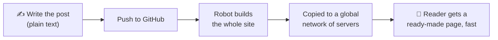
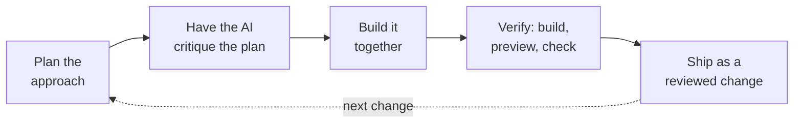

It started with an email. Medium wanted me to migrate the custom domain of my publication to their new
system before a deadline. On its own it was a small, routine request. But it brought back a thought I
had been putting off for years: maybe it was time I owned my writing again, end to end.

It has been more than seven years since I wrote here regularly. In that time I have changed as an
engineer, and the way we build software has changed even more. So instead of clicking through Medium's
migration steps, I did something that took a little longer and taught me a great deal more: I rebuilt
this blog from scratch, moved it off Medium, and brought it back on a modern setup, with AI coding
tools as my pair. This post is about the **why** and the **what** of that move, and about the new way
of learning and building software I found along the way.

## Why bother, when migrating was 15 minutes?

Three reasons, in increasing order of importance.

First, **ownership**. My words and the home they live in should be mine. A custom site means I decide
how it looks, how fast it is, and where it is hosted, without asking anyone's permission or fitting
into someone else's template.

Second, **longevity**. Writing I did a decade ago should still be reachable at the same web address
today. Platforms come and go; a setup I control gives my old links a fighting chance at staying alive.

Third, and the real motivation, **learning**. I have spent years building software, and I wanted to
see how that experience holds up against the way applications are built today. A personal project is
a low-risk place to find out.

## What I moved to

The new site is what people in my field call a _static site_, hosted in a _serverless_ way. Those
terms sound technical, so here is the plain-English version.

A **static site** means every page is baked into its final form ahead of time, like printing a
magazine. When you open this page, no server has to assemble it from scratch for your visit; it was
already finished and is simply handed over. That makes it fast, hard to break, and cheap to run.

**Serverless** means I do not rent or babysit a server of my own. The finished pages are copied onto a
network of computers spread around the world, so the copy that reaches you usually comes from one
reasonably close by. There is nothing for me to patch at midnight and, for a site this size, it can be
effectively free to run.

The third piece is how a new post actually travels from my laptop to your screen:

What I find genuinely nice about today's tooling is how much of this is free, automatic, and safe by
default. Every change I make is proposed as a reviewable bundle with its own private preview link, so
I can _see_ the change live before the world does. When I approve it, the site rebuilds and redeploys
on its own. The kind of pipeline that used to be a serious undertaking is now a sensible default for a
personal blog.

## Where the AI came in

Here I should be transparent: as of writing this, I work at Microsoft, and the main tool I used,
**GitHub Copilot CLI**, comes from GitHub and Microsoft. I have been leaning on it heavily at work, so
I wanted to try it on something personal, as a way to learn rather than just to ship.

The interesting part was not that the AI wrote code. It was _how we divided the work_. The useful
split was this: I stayed responsible for the judgment, while the tool helped me move faster. I decided
**what** to build and **why** each choice mattered: keep every old web address working with redirects,
pick a framework that produces a fast site, add comments and privacy-friendly analytics, support dark
mode, guard quality with automated checks. The AI handled much of the mechanical **how**, and it did
so quickly enough that I could explore options instead of committing to the first one.

I worked in a loop that looked like this:

My favourite habit from this was the second box: before building anything non-trivial, I had the AI
play devil's advocate against its own plan until we actually agreed. It caught blind spots early, when
fixing them was still cheap. (This very post went through the same treatment.)

The whole thing took a focused afternoon of planning, pressure-testing the plan, and building. That
speed is the headline, but it is not the lesson.

## The lesson

The lesson is that **AI did not replace what I know; it rewarded it**. Every good decision along the
way came from years of building software: knowing that old links must not break, that a site should be
fast for the reader and not just the author, that quality is cheaper when it is checked automatically.
The AI made the first working version arrive much faster, but I still had to know which ideas were
worth having. That, to me, is the real shift: not just a faster way to build, but a new way to _learn_
while building, with your own experience as the steering wheel.

If you have been building software for a while and have been watching these tools from a distance, I
would gently suggest a practical experiment: pick a small, personal project you care about, and use
one of these tools to build it the modern way. You will learn the new tools, and you will rediscover
how much your existing experience is worth.

It feels good to be writing in public again, on a setup that is finally, fully, mine.

---

_This site is open source. If you are curious how any of the above is wired together, the code lives
on [GitHub][repo]._

[repo]: https://github.com/praveer09/praveer09.github.io
