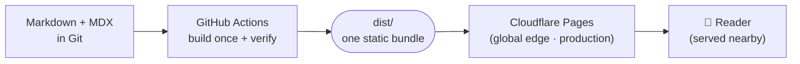
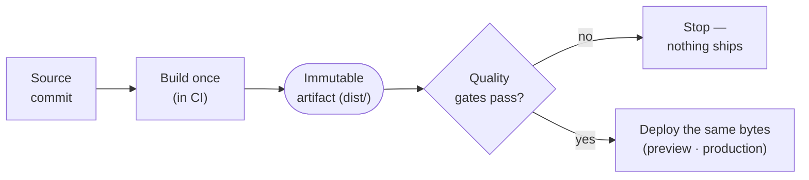
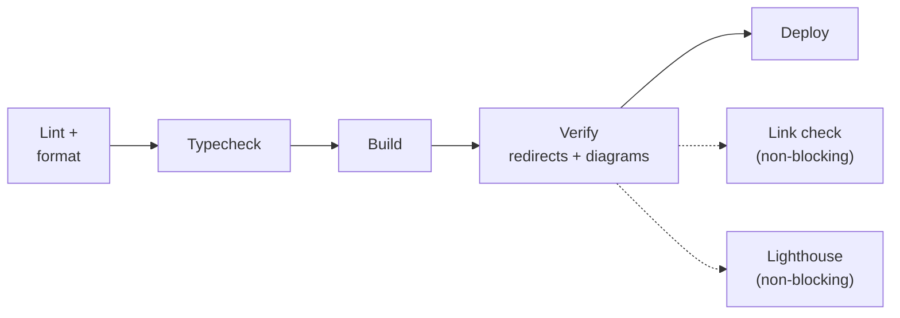

In an [earlier post][why] I wrote about _why_ I rebuilt this blog: to own my writing again, and to
learn the modern way of building software while I was at it. This post is the **how**. It is a tour of
the architecture — the moving parts, the decisions behind them, and, just as importantly, the
trade-offs I accepted for each one.

I have written it for people who build software. So rather than hide the seams, I want to show them.
Every choice below earned its place by being **reversible, automatable, or both** — and every one of
them gave something up in return. That tension is the real story.

## The shape of the system

Here is the whole thing on one page. A post is plain text in Git; a build turns the repository into a
finished website; that one finished bundle is validated and then handed, unchanged, to the edge that
serves it.

Keep that picture in mind — it is the skeleton. Here is the same journey with every actual tool named,
so the rest of the post has a map to point at. It groups into six stages: how I write, where the source
lives, what the build does, how it ships, where it is served, and what reaches the reader.

```mermaid
flowchart TB
  accTitle: The full stack, end to end
  accDescr: The end-to-end toolchain in six stages. Authoring is Markdown, MDX and Mermaid. Source and tooling is Git on GitHub with pnpm, Node and Dependabot. The build, run by GitHub Actions, uses Astro with TypeScript and Tailwind, sharp for images and Playwright-driven Chromium to render Mermaid to SVG, gated by ESLint, Prettier, astro check, redirect and diagram verifiers, lychee and Lighthouse. Deployment is wrangler Direct Upload. Serving is Cloudflare Pages at the edge with a GitHub Pages mirror. Reaching the reader are giscus comments and cookieless Cloudflare Web Analytics in the page, plus RSS and sitemap feeds.
  subgraph A["1 · Authoring"]
    A1["Markdown + MDX<br/>(posts as files)"]
    A2["Mermaid<br/>(diagrams as text)"]
  end
  subgraph B["2 · Source & tooling"]
    B1["Git + GitHub"]
    B2["pnpm · Node 22"]
    B3["Dependabot<br/>(dependency PRs)"]
  end
  subgraph C["3 · Build — GitHub Actions"]
    C1["Astro 6 · TypeScript<br/>Tailwind 4 · sharp"]
    C2["Mermaid → SVG<br/>(Playwright · Chromium)"]
    C3["Gates: ESLint · Prettier · astro check<br/>verify-redirects · verify-diagrams<br/>lychee · Lighthouse"]
  end
  subgraph D["4 · Deploy"]
    D1["wrangler<br/>Direct Upload"]
  end
  subgraph E["5 · Serve"]
    E1["Cloudflare Pages<br/>(edge · praveergupta.in)"]
    E2["GitHub Pages<br/>(mirror)"]
  end
  subgraph F["6 · Reaches the reader"]
    F1["giscus<br/>(comments)"]
    F2["Cloudflare Web Analytics<br/>(cookieless)"]
    F3["RSS · sitemap<br/>(feeds)"]
  end
  A --> B --> C --> D --> E --> F
```

With the map in hand, the rest of the post zooms into the four decisions that gave it this shape.

## Decision 1: a static site

The foundation is that every page is compiled to its final HTML _ahead of time_, during a build, and
never assembled per request. There is no application server, no database, no runtime to keep alive.

**Benefit.** Speed, security, and cost all fall out of this one choice. A pre-built file served from a
machine near the reader is hard to beat on latency; there is no server-side code path for an attacker
to reach; and serving flat files at this scale is effectively free. It is also wonderfully boring —
there is nothing to wake up and patch at 2 a.m.

**Trade-off.** Anything dynamic has to move somewhere else. Comments, search, and analytics become
client-side widgets or third-party services rather than server features. And "publish" is no longer
instant: every change requires a rebuild before it is visible. For a blog that is a fine bargain; for
an app with per-user state it would not be.

## Decision 2: Astro as the generator

Plenty of tools turn Markdown into a static site. I chose **Astro** (with TypeScript, Tailwind, and
MDX) over the Jekyll setup this blog used to run on.

**Benefit.** The win I feel every single time I sit down to write: **a post is just a Markdown (or
MDX) file in a folder.** There is no CMS, no database, and no admin panel between me and the words —
authoring is plain text, and maintenance is mostly _editing files_ and committing them. That keeps my
attention on writing rather than on running a platform, and it makes the whole site easy to reason
about and cheap to keep alive for years. Astro builds on that content-first foundation: it ships **zero
JavaScript by default** — a page with no interactive parts downloads no framework at all, which is
exactly what you want for an article. When I _do_ need interactivity, its "islands" model lets me
hydrate one component without dragging the whole page into a client-side app, and MDX lets that
component sit right inside a post when prose alone is not enough. TypeScript checks my content's
frontmatter against a schema, so a malformed post fails the build instead of shipping broken. Tailwind
keeps styling local to the markup instead of sprawling across global stylesheets.

**Trade-off.** This is a younger, faster-moving ecosystem than the Ruby/Jekyll world it replaced. I am
on Astro 6 and Tailwind 4 — both excellent, both still evolving — which means major versions land more
often and the occasional plugin is less battle-tested; MDX, too, buys its richness with a heavier build
than plain Markdown. I pay for the modern developer experience with a steeper upgrade treadmill. I
blunt that by keeping installs reproducible — a committed lockfile and frozen installs — and letting
automated dependency updates (Dependabot) arrive as reviewable pull requests rather than surprises.

## Decision 3: build once, deploy many

This is the decision the title is named after, and the one I am happiest about. The naive way to host
a static site is to let the host rebuild it from source on every push. The better way is to build the
site **exactly once**, in CI, validate _that_ build, and then deploy the same finished bytes to every
environment that serves it — preview and production alike.

Why this matters is easiest to explain with the bug that taught it to me. I render diagrams — like the
ones in this post — to static SVG _at build time_, which needs a headless browser. My host built the
site without one. The result was not a loud error; it was worse. A diagram that failed to render
silently blanked the entire post body, and that empty page shipped to production looking perfectly
fine to the build.

My first fix was a workaround: pre-render the diagrams locally, commit the rendered output as a cache,
and have the browserless host read from it. It worked, but it was a pile of moving parts — a binary
cache file in Git, dependency patches, a native SQLite module — all to paper over the fact that **two
different environments were building my site two different ways**. The real fix was to delete that
class of problem entirely: build once, in the environment that _has_ a browser, and ship the result.
The cache, the patches, and the native module were all deleted along with the problem.

**Benefit.** The bytes you test are the exact bytes you ship, so an entire class of "works in CI,
breaks in production" failures has nowhere left to hide. Each deploy is a re-upload of a known-good
artifact, so — as long as I keep that artifact around — rolling back is just redeploying the previous
one. And because every deploy is fed from a single build, fanning out costs almost nothing: every pull
request gets its own preview deployment from the very artifact that may later become production. (I
also keep a GitHub Pages mirror for redundancy; today it rebuilds from the same source through its own
workflow — a small seam I would close by having it consume this exact artifact instead.)

**Trade-off.** I gave up the host's turnkey convenience. I now own a deploy step, which means I manage
a deploy credential as a secret and keep that pipeline working myself; rendering diagrams at build time
also keeps a headless-browser dependency in CI — heavier builds in exchange for diagrams that ship as
plain SVG with no client-side JavaScript. I traded a managed black box for a glass box I have to
maintain — a trade I will take every time, because the glass box is the part I actually want to
understand.

## Decision 4: quality gates that run themselves

If a machine is going to deploy on my behalf, I want it to refuse when something is wrong. Every change
runs through a sequence of automated gates before anything reaches a reader.

The blocking gates are non-negotiable: linting and formatting, a typecheck, a clean build, and then
two custom post-build checks that assert what generic tools cannot — that every old URL still
resolves, and that every diagram actually rendered (the very check that would have caught my blank
page). Two more gates — a link checker and a Lighthouse performance audit — run as **non-blocking**
signals: they report, but they do not stop a deploy.

**Benefit.** Quality stops being a thing I remember to do and becomes a property of the pipeline. The
checks that encode hard-won lessons — _don't break a URL, don't ship a blank diagram_ — run on every
single change, forever, without my attention.

**Trade-off.** A pipeline is itself software to own, and the line between "blocking" and "non-blocking"
is a judgement call. Make too much blocking and a flaky external link can wall off an unrelated fix;
make too little and regressions slip through. I keep only deterministic, in-my-control checks blocking,
and let the noisier signals advise rather than gate.

## The decision ledger

If you remember nothing else, remember the pattern: **every choice bought something and cost
something.** Here is the whole post in one table.

| Decision                | What it buys                                     | What it costs                                       |
| ----------------------- | ------------------------------------------------ | --------------------------------------------------- |
| Static site             | Speed, security, near-zero cost                  | No server-side dynamics; publishing means building  |
| Astro generator         | Markdown authoring, zero-JS pages, typed content | Younger, faster-moving ecosystem to keep current    |
| Build once, deploy many | Tested bytes _are_ shipped bytes; easy rollback  | A deploy step and a secret to own yourself          |
| Self-running gates      | Lessons enforced automatically, on every change  | A pipeline to maintain; blocking vs. advisory calls |

## What I would tell my past self

Three principles survived the rebuild, and they are not really about Astro or Cloudflare at all.

**Prefer reversible decisions.** Almost nothing here is a one-way door. Reproducible installs, keeping
the built artifact around, mirroring to a second host — each keeps a cheap path back if I am wrong.

**Automate the verification, not just the work.** The build was never the risky part; _knowing it was
correct_ was. The checks that assert "the URL resolves" and "the diagram rendered" do more for this
site's reliability than any single line of its code.

**Own the seams.** The blank-diagram bug lived in the gap between two environments. Collapsing that gap
— one build, one artifact — did not just fix a bug; it removed the place the bug could live. Most of
the reliability here came from owning the joins between parts, not the parts themselves.

That is the anatomy. Small site, ordinary parts — but every seam is one I now understand, and that was
the whole point.

---

_This site is open source. If you want to see exactly how any of the above is wired together, the code
lives on [GitHub][repo]._

[why]: /blog/a-new-way-to-learn-and-build-software/
[repo]: https://github.com/praveer09/praveer09.github.io
