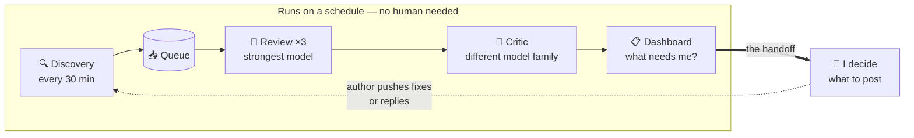
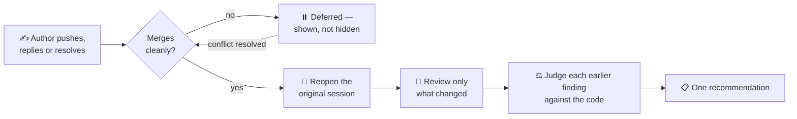

I have always used pull request reviews to stay grounded. Reading someone else's change is the cheapest
way I know to learn what problem is being solved and where the sharp edges are.

Lately that habit has been hard to sustain, so I built an agentic workflow to protect it. This is what it
does, and what it taught me.

_A note first: this is a personal workflow, not an employer system or a statement of anyone's policy. I
describe its architecture and the lessons, not the code it reviews._

## Why this matters now

As agents make changes cheaper to produce, two things can shift at once.

The obvious one is **volume**: more change, arriving faster. The less obvious one is **who writes it**.
Making a plausible change in an unfamiliar codebase used to be expensive, and that expense kept people in
their own corner of a system. It is much cheaper now. I welcome that. I want to follow a problem across a
boundary when that is what solving it takes, and I would rather others could too.

But making a plausible change is not the same as understanding its place in a system, and that is where
the owner's job moves. Local correctness still matters. The risk that gets _added_ is **drift**:
individually reasonable changes whose assumptions quietly conflict, pulling the system somewhere nobody
chose.

Review is one defence against that, and it works under two conditions. It has to be **timely**, because
feedback is easier to act on while the change is still being shaped. And it has to judge **intent and
fit**, not just correctness.

Both conditions depend on one thing, and it is what volume erodes first: _you cannot judge whether a
change fits a direction you have lost track of._

## What I optimised for

Not throughput. The goal is that **my picture of the code stays current enough to judge with**, because
when my picture is stale I mistake a preference for a well-grounded objection.

Here is the division that makes that possible. In this workflow, the model handles much of the initial
inspection: reading the diff, following a call chain, noticing the unhandled case. I do not delegate the
question of whether a change _should exist in this shape_. Not because a model cannot reason about design
(given context, it can), but because that judgment is the part I remain accountable for.

So the design question was never "how do I review faster." It was: how do I let the analysis run at
machine speed without quietly outsourcing the judging?

> **In short:** the agent prepares the analysis; I still read the change and make the call.

## How it is put together

Three stages, on a schedule, each independent so a slow run of one does not block the next run of another.
It runs on my workstation through GitHub Copilot CLI.

- **Discovery**: every 30 minutes, mid-tier model. Finds new pull requests, records observations, notices
  what merged or changed.
- **Review**: every 30 minutes, three parallel slots, strongest reasoning model. Takes one item and writes
  an artifact that opens with small diagrams of where the change sits, _before_ it lists a single finding.
- **Reflection**: every two days. Reads recent reviews for lessons worth folding back in.

Splitting discovery from review was the first thing I got right. My first version did both in one pass,
and a slow review stalled discovery, so new pull requests went unnoticed for reasons that had nothing to
do with them.

Inside the review stage, **every draft is critiqued by a model from a different family before I see it**.
It has refuted findings that read as correct but were not, and caught problems the first pass walked past.
(This post got the same treatment.)

I cannot prove the different-family part is what does the work. A second pass by the same model, told to
argue against its own findings, might do just as well. I have not run that comparison. What I am confident
about is that making the pass mandatory rather than optional mattered. A step you can skip when you are
busy is missing exactly when you needed it.

> **In short:** cheap model for mechanical work, strongest for reasoning, and a mandatory second opinion
> before anything reaches me.

## Writing the judgement down

The reviewing agent follows a long document describing how _I_ review: what is blocking versus a nitpick,
how to verify a claim instead of accepting it, how to phrase a finding as a question rather than a
verdict.

Writing that down was more clarifying than building any of the automation. Much of what I thought were
principles turned out to be reflexes I had never examined, and some did not survive being stated plainly.

Every line in it exists because I caught myself making the same correction twice. That raises the question
of who writes it down the third time. It is the reflection stage. It reads recent sessions for repeatable
lessons, especially the findings I edited or dropped before posting, since that is me correcting the
machine in my own hand. It may add guidance directly, but may only _propose_ removals, and may never
weaken the mandatory gates. An agent permitted to delete its own safety rails is not self-improving; it
has a slow leak.

> **In short:** the standard is a written artifact, worth having even without the automation, and it
> improves faster than I would maintain it by hand.

## Re-reviews: the part I underestimated

A review is not a one-shot event. The author pushes fixes, replies, resolves threads. Manually, you start
over trying to remember what you said.

Getting the trigger right took two attempts. My first version compared the platform's revision counter,
which also increments when the _target_ branch moves. Since the main branch moves constantly, everything
kept getting re-flagged and each re-review found nothing had changed. Now it compares the **source
branch's commit hash**, which changes when the branch itself changes rather than when the target moves
beneath it.

When an item returns, the agent reopens the original session (so the earlier reasoning is already in
context), reviews only the delta, judges each earlier finding against the code rather than against the
author's claim, and ends with one recommendation.

> **In short:** returning to a conversation costs a focused verification pass instead of a full context
> rebuild.

## The harness, and keeping it alive

It is tempting to think a workflow like this is a model with some plumbing attached. My experience was the
reverse. Once the model was good enough for the task, **almost every improvement came from the surrounding
workflow**: the scheduling, the queue, the atomic claim that stops two slots grabbing the same pull
request, the state validation, the health checks, the report.

Because the failure mode that matters is silence.

One morning the dashboard showed almost nothing outstanding. Pleasant, briefly. A model identifier I had
pinned had been retired by the provider overnight, and every discovery run had failed instantly for over a
day. Nothing crashed, nothing alerted. And since discovery is what notices merged pull requests, the board
had quietly frozen. My own health check reported "no problems found" throughout, because it was checking
whether anything had _run recently_. It had: failing, every thirty minutes. **Liveness is not health.**

The other incidents rhyme. An agent asked to update the queue decided the file looked empty and rebuilt
it, dropping most of the tracked history, recovered only because I happened to still have an old dashboard
open in a browser tab. That is luck, not a recovery plan. And a phrase in the generated instructions,
"skip step 1", collided with a _file_ named `step1`, sending sessions off to read the wrong stage's
instructions entirely.

A better model would not have prevented these on its own. What they needed was outcome-based health
checks, guarded queue writes and unambiguous instructions. These were failures in the environment around
the model, and the environment keeps moving.

So I check on it: the health output, a sample of what it produced, whether what it flagged is what I would
have flagged. The more I rely on it, the more consequential a quiet failure becomes, and an earlier
successful run is not evidence that it still works.

> **In short:** continuous improvement did not go away. The workflow simply became another piece of
> software I have to maintain.

## Where this might be fooling me

The failures in the last section were the visible kind. The one I actually worry about is quieter: that
the workflow works well enough that I stop doing the thing it exists to protect.

There are two versions of that, and I have resolved neither.

**I may be reading less than I think.** What I can demonstrate is current _preparation_, not current
understanding. If all I ever consumed was a list of findings, the workflow would be steering my attention
toward its own view of what matters, and a change that is directionally wrong while producing no finding
is precisely the one my argument says I must catch.

The partial answer is that a review does not open with findings. It opens with diagrams: where the change
sits in the end-to-end flow, which components it touches, what the before and after look like. I read
those first, and they have turned out to be the part that compounds. Each one adds to a picture of the
system rather than to a list of defects, and seeing enough of them has sharpened my instinct for when
something sits oddly, which is the instinct drift actually requires. Whether it is a sufficient defence, I
do not know.

**I may be agreeing more than I think.** _Recommend approve_ is a hypothesis, not a verdict, and a
well-argued one is comfortable to accept. Nothing in the design makes disagreeing the easier path.

Two smaller things I have not solved. The agent reads descriptions and replies written by others, and what
keeps a draft off the pull request is how the instructions are written rather than a permission I have
removed, so it bounds what a hostile input could do without eliminating it. And the whole thing runs on a
workstation, at the cost of some compute, so "always current" really means "current whenever my machine
has been on."

> **In short:** it reliably keeps me prepared. Whether it keeps me _grounded_ is the part I have to keep
> checking myself on.

## The takeaway

The mechanical half of reviewing got dramatically cheaper. The judging did not — and it is what an owner
owes a codebase they are responsible for.

What the automation bought me was not speed. It was the removal of what used to crowd out the judging, and
enough continuity that I still recognise the system I am looking at.

The rest was ordinary software engineering applied to a new kind of component. That part your existing
experience already prepares you for.

---

_If this resonates, do not start by building a pipeline. Start by writing down what you actually look for
when you review: the specific things, not the platitudes. It is an explicit account of your review
criteria, and it is worth having on its own. Hand it to an agent afterwards and you will find out quickly
which of your standards were real and which were unexamined habit._

_More of mine were unexamined than I would have guessed._
